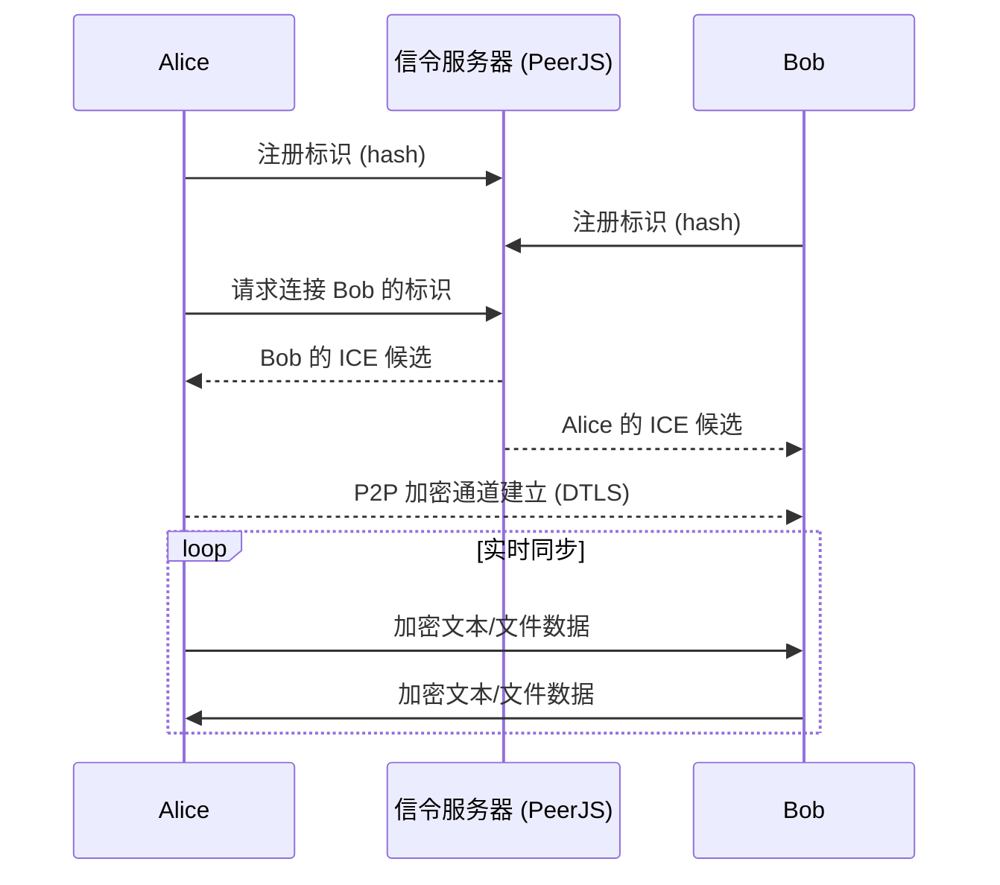

# 📋 p2p-clipboard · 共享剪切板

> 🔒 真正隐私安全的实时共享剪贴板 —— 文本与文件仅在浏览器之间点对点直传，不经过任何服务器。

**p2p-clipboard** 是一款完全运行在浏览器中的纯静态 P2P 工具。基于 WebRTC 技术，在两个浏览器之间建立直接的点对点加密通道，**无需任何中心服务器中转数据**。你可以像使用本地剪切板一样，实时同步文本和文件，享受极速、安全、匿名的共享体验。

📡 在线使用：**[e5c8f.github.io/p2p-clipboard](https://e5c8f.github.io/p2p-clipboard/)**  
📖 完整文档 & Wiki：**[deepwiki.com/E5C8F/p2p-clipboard](https://deepwiki.com/E5C8F/p2p-clipboard)**  
🧬 源码仓库：**[github.com/E5C8F/p2p-clipboard](https://github.com/E5C8F/p2p-clipboard)**

---

## ✨ 为什么选择 p2p-clipboard？

- ✅ **真正的端到端加密**  
  所有数据（文本、文件）通过 WebRTC 的 DTLS 协议加密传输，只有你和对方能解密，中间任何人（包括信令服务器）都无法窃听内容。

- ✅ **零服务器存储**  
  你的数据不会经过任何云服务器，更不会被存储或分析。信令服务器仅用于交换连接信息，连接成功后数据完全走 P2P 通道。

- ✅ **实时同步，毫秒级响应**  
  在文本框中输入内容，1 秒内自动推送给对方；选择文件后，对方立刻看到文件列表并可以随时下载。

- ✅ **跨平台，无需安装**  
  只要有浏览器，无论是电脑、手机、平板，打开网页即可使用。支持 Chrome、Edge、Firefox、Safari 等现代浏览器。

- ✅ **匿名标识，保护隐私**  
  你可以随机生成 6 位数字作为临时身份，也可以自定义字符串，无需注册、无需登录。

- ✅ **双向文件共享**  
  支持同时发送多个文件，对方可以按需下载，也可以选择性删除文件列表。

- ✅ **开放源码，可自部署**  
  完全开源，你可以直接部署到 GitHub Pages、Vercel 或自己的服务器上，彻底掌控数据通路。

---

## 🚀 快速开始

### 🌐 在线使用（推荐）

直接访问我们部署在 GitHub Pages 上的公共实例：

```
https://e5c8f.github.io/p2p-clipboard/
```

1. 你和你的朋友 **同时打开这个页面**。
2. 点击 **📡 申请** 获取一个临时标识（或手动输入一个易记的标识）。
3. 告诉对方你的标识，或者让对方告诉你他的标识。
4. 在 **🎯 目标标识** 中填入对方的标识，点击 **🔗 连接**。
5. 连接成功后，你就可以：
   - 在 **📝 共享文本** 区域打字，对方会实时看到。
   - 点击 **📁 共享文件** 选择文件，对方会收到文件列表并可下载。

### 🖥️ 本地运行

1. 克隆仓库  
   ```bash
   git clone https://github.com/E5C8F/p2p-clipboard.git
   cd p2p-clipboard
   ```

2. 使用任意静态服务器打开（三个文件必须保持在同一目录）  
   ```bash
   # 若安装了 Node.js
   npx serve .

   # 或使用 Python
   python -m http.server 8080
   ```

3. 浏览器打开 `http://localhost:3000`（或对应端口），即可使用。

---

## 🧠 工作原理



1. 双方浏览器通过 PeerJS 信令服务器交换连接信息（仅元数据，无业务数据）。
2. 随后双方浏览器尝试建立 **直接对等连接**（优先局域网直连，失败时可能通过 TURN 中继，但数据仍加密）。
3. 连接建立后，所有文本和文件数据均通过加密的 DataChannel 直接传输，不经过任何服务器。
4. 文件传输完全在内存中进行，对方下载时直接创建 Blob URL，本地不留痕迹。

---

## 🗂️ 文件结构

```
p2p-clipboard/
├── index.html        # 主界面与样式
├── 剪切板.js          # 全部业务逻辑（PeerJS 通信、文件处理、日志）
├── README.md         # 你正在阅读的文档
└── .gitignore        # 忽略系统文件
```

- `index.html` 和 `剪切板.js` 采用原生 JavaScript 编写，无构建工具。
- 依赖项（PeerJS、noble-hashes）通过 ES Module 动态导入，首次打开时会自动从 CDN 加载。

---

## ⚙️ 高级用法 & 自定义

### 修改信令服务器

默认使用 PeerJS 官方免费信令服务器，如果你希望更高的稳定性或隐私性，可以自建 PeerJS 服务器，并在 `剪切板.js` 中修改实例化参数：

```javascript
新连接 = new Peer(标识哈希, {
  host: '你的信令服务器地址',
  port: 443,
  path: '/'
});
```

### 部署到自己的服务器

只需将三个文件（`index.html`、`剪切板.js`、可选的 `favicon.ico`）放到任何支持 HTTPS 的静态文件服务目录即可，因为浏览器要求 WebRTC 必须在安全上下文（HTTPS 或 localhost）下运行。

---

## 📚 完整 Wiki

更多详细用法、常见问题排错、自建信令服务器指南等内容，请访问我们的 **DeepWiki**：

👉 **[https://deepwiki.com/E5C8F/p2p-clipboard](https://deepwiki.com/E5C8F/p2p-clipboard)**

---

## ⚠️ 常见问题 & 注意事项

- **连接失败？**  
  WebRTC 在对称 NAT 或严格防火墙后可能需要 TURN 中继服务器。默认 PeerJS 官方服务器提供了 TURN 中继，如果仍失败，可以自建 PeerJS 服务并配置 TURN（详见 Wiki）。

- **文件大小限制？**  
  理论上受浏览器内存限制，建议单个文件不超过 500 MB。超大文件传输可能导致页面卡顿。

- **隐私性说明**  
  随机生成的 6 位数字标识（或自定义标识）会通过 SHA-256 哈希后作为 Peer ID，原标识不会泄露。但标识本身是公开交换的，不要在其中包含敏感个人信息。

- **多设备连接？**  
  目前仅支持一对一连接。如果需要多人共享，可以每个人都两两连接，但界面未做多人管理。

---

## 🤝 贡献

欢迎提交 Issue 或 Pull Request！如果你有新功能想法或发现 Bug，请到 [GitHub Issues](https://github.com/E5C8F/p2p-clipboard/issues) 提出。

---

## 🙏 致谢

- [PeerJS](https://peerjs.com/) – 简化 WebRTC 的神器
- [noble-hashes](https://github.com/paulmillr/noble-hashes) – 纯净的 SHA-256 实现
- 所有为开源社区贡献的开发者们

---

<p align="center">
  <sub>由 <a href="https://github.com/E5C8F">E5C8F</a> 用 ❤️ 构建 · 数据权属于你</sub>
</p>
